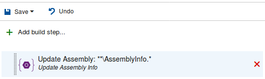
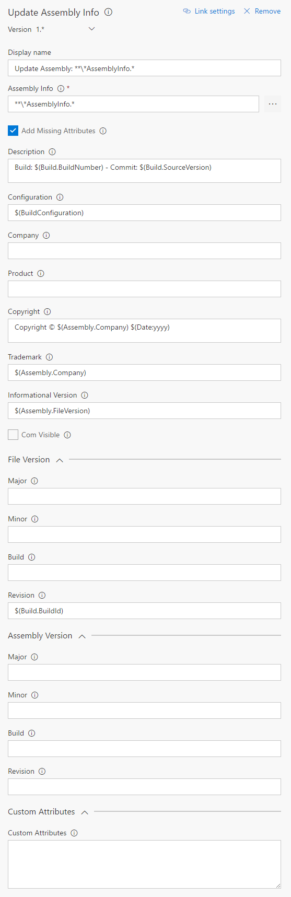

# Update Assembly Info
Update assembly info of one or multiple projects during build.

## Usage
Add a new **Update Assembly Info** task from the **Utility** category...

...and configure it as needed.

Parameters include:
* **Assembly Info**: Relative path from repo root of the assembly info file(s). Variables can be used, eg. `$(Build.SourcesDirectory)`. You can also use wildcards, eg. `**\AssemblyInfo.*` for all AssemblyInfo.* files in all sub folders.
* **Add Missing Attributes**: Adds attribute to assembly info file if it is missing. If the attribute is not specified in this task it will not be added.
* **Description**: Left blank, the value is not updated. Variables can be used including these task-specific variables:
    * `$(Assembly.Company)`: The value provided for Company.
    * `$(Assembly.Product)`: The value provided for Product.
    Use the `$(Date:{...})` variable to generate date value.
    Use `$(Invalid)` to throw error and force the user to change the value to something useful.
* **Configuration**: Left blank, the value is not updated. Variables can be used, eg. `$(BuildConfiguration)`. Use `$(Invalid)` to throw error and force the user to change the value to something useful.
* **Company**: Left blank, the value is not updated. Variables can be used. Use the `$(Date:{...})` variable to generate date value. Use `$(Invalid)` to throw error and force the user to change the value to something useful.
* **Product**: Left blank, the value is not updated. Variables can be used. Use the `$(Date:{...})` variable to generate date value. Use `$(Invalid)` to throw error and force the user to change the value to something useful.
* **Copyright**: Left blank, the value is not updated. Variables can be used, including these task-specific variables:
    * `$(Assembly.Company)`: The value provided for Company.
    * `$(Assembly.Product)`: The value provided for Product.
    Use the `$(Date:{...})` variable to generate date value.
    Used togeather this could produce "Copyright © YourCompanyName 2017".
    Use `$(Invalid)` to throw error and force the user to change the value to something useful.
* **Trademark**: Left blank, the value is not updated. Variables can be used, including these task-specific variables:
    * `$(Assembly.Company)`: The value provided for Company.
    * `$(Assembly.Product)`: The value provided for Product.
    Use the `$(Date:{...})` variable to generate date value.
    Use `$(Invalid)` to throw error and force the user to change the value to something useful.
* **Informational Version**: Left blank, the value is not updated. Variables can be used, inlcuding these task-specific variables:
    * `$(Assembly.FileVersion)`: The assembly file version value.
    * `$(Assembly.FileVersionMajor)`: The assembly file version major value. Requires Major to be specified.
    * `$(Assembly.FileVersionMinor)`: The assembly file version minor value. Requires Minor to be specified.
    * `$(Assembly.FileVersionBuild)`: The assembly file version build value. Requires Build to be specified.
    * `$(Assembly.FileVersionRevision)`: The assembly file version revision value. Requires Revision to be specified.
    * `$(Assembly.AssemblyVersion)`: The assembly version value.
    * `$(Assembly.AssemblyVersionMajor)`: The assembly version major value. Requires Major to be specified.
    * `$(Assembly.AssemblyVersionMinor)`: The assembly version minor value. Requires Minor to be specified.
    * `$(Assembly.AssemblyVersionBuild)`: The assembly version build value. Requires Build to be specified.
    * `$(Assembly.AssemblyVersionRevision)`: The assembly version revision value. Requires Revision to be specified.
    Use the `$(Date:{...})` variable to generate date value.
    Use `$(Invalid)` to throw error and force the user to change the value to something useful.
* **Com Visible**: True or False
* **File Version - Major**: Left blank, the value is not updated. Variables can be used, eg. `$(Build.BuildId)`. Use the `$(Date:{...})` variable to generate date value (must generate a numeric value). Use `$(Invalid)` to throw error and force the user to change the value to something useful.
* **File Version - Minor**: Left blank, the value is not updated. Variables can be used, eg. `$(Build.BuildId)`. Use the `$(Date:{...})` variable to generate date value (must generate a numeric value). Use `$(Invalid)` to throw error and force the user to change the value to something useful.
* **File Version - Build**: Left blank, the value is not updated. Variables can be used, eg. `$(Build.BuildId)`. Use the `$(Date:{...})` variable to generate date value (must generate a numeric value). Use `$(Invalid)` to throw error and force the user to change the value to something useful.
* **File Version - Revision**: Left blank, the value is not updated. Variables can be used, eg. `$(Build.BuildId)`. Use the `$(Date:{...})` variable to generate date value (must generate a numeric value). Use `$(Invalid)` to throw error and force the user to change the value to something useful.
* **Assembly Version - Major**: Left blank, the value is not updated. Variables can be used, eg. `$(Build.BuildId)`. Use the `$(Date:{...})` variable to generate date value (must generate a numeric value). Use `$(Invalid)` to throw error and force the user to change the value to something useful.
* **Assembly Version - Minor**: Left blank, the value is not updated. Variables can be used, eg. `$(Build.BuildId)`. Use the `$(Date:{...})` variable to generate date value (must generate a numeric value). Use `$(Invalid)` to throw error and force the user to change the value to something useful.
* **Assembly Version - Build**: Left blank, the value is not updated. Variables can be used, eg. `$(Build.BuildId)`. Use the `$(Date:{...})` variable to generate date value (must generate a numeric value). Use `$(Invalid)` to throw error and force the user to change the value to something useful.
* **Assembly Version - Revision**: Left blank, the value is not updated. Variables can be used, eg. `$(Build.BuildId)`. Use the `$(Date:{...})` variable to generate date value (must generate a numeric value). Use `$(Invalid)` to throw error and force the user to change the value to something useful.

### The `$(Date:{...})` Variable
The `$(Date:{...})` variable is a powerful way of generating date values. It can be used in all input fields.
Examples:
* `$(Date:yyyy)`: '2017' (Year in four digits)
* `$(Date:MMMM)`: 'April'
* `$(Date:MM)`  : '04' (Numeric month)
* `$(Date:dddd)`: 'Sunday'
* `$(Date:dd)`  : '23' (The day of the month)
* `$(Date:HH)`  : '20' (The hour in24 hour format)
* `$(Date:mm)`  : '22' (The minute)
* `$(Date:ss)`  : '27' (The second)
See [list of date formats](https://ss64.com/ps/syntax-dateformats.html) for more examples.

Can be combined, with or without separators, to produce custom date formats.
`$(Date:yyyy, MMMM, MM, dddd, dd, HH, mm, ss)` will generate eg. '2017, April, 04, Sunday, 23, 20, 22, 27'

### The `$(Invalid)` Variable
Use `$(Invalid)` in any input field to throw error and force the user to change the value to something useful. This can be useful when working with task groups or creating a template.
Defining eg. 'Description' as 'This description is $(Invalid)' or simply '$(Invalid)' will throw an error and force the user to specify a meningful description.

### Output Variables
Variables that can be used by subsequent tasks.
Values from the first assembly info file will be passed to variables if multiple files are updated.
* `$(Assembly.FileVersion)`: The assembly file version value.
* `$(Assembly.AssemblyVersion)`: The assembly version value.

## Changelog
* **2.0.13**: Added support for alternate file names and output parameters.
* **2.0.11**: Added 'Com Visible' functionality.
* **2.0.0**: Added 'Assembly Version' functionality.

## Having Problems?
Please [create an issue on our Github](https://github.com/BoolBySigma/UpdateAssemblyInfo/issues) and we will try to help you.

Icons made by [Freepik](http://www.freepik.com) from [Flaticon](http://www.flaticon.com) is licensed by [CC 3.0 BY](http://creativecommons.org/licenses/by/3.0/)