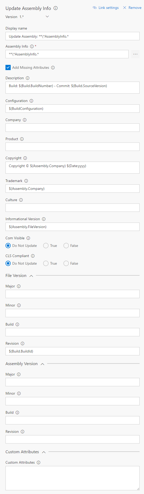

# Update Assembly Info
Fetch build artifacts from any project and build definition.

## Usage
Add a new **Update Assembly Info** task from the **Utility** category...

...and configure it as needed.

Parameters include:
* **Assembly Info**: Relative path from repo root of the assembly info file(s). Variables can be used, eg. `$(Build.SourcesDirectory)`. You can also use wildcards, eg. `\\*\\*\\AssemblyInfo.\\*` for all AssemblyInfo.* files in all sub folders.
* **Description**: 
* **Configuration**:
* **Company**:
* **Product**:
* **Copyright**:
* **Trademark**:
* **Informational Version**:
* **File Version - Major**:
* **File Version - Minor**:
* **File Version - Build**:
* **File Version - Revision**:

Icons made by [Freepik](http://www.freepik.com) from [Flaticon](http://www.flaticon.com) is licensed by [CC 3.0 BY](http://creativecommons.org/licenses/by/3.0/)