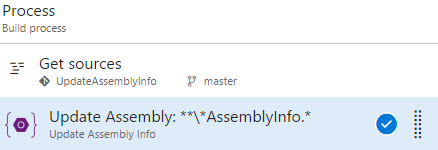

# Update Assembly Info
Fetch build artifacts from any project and build definition.

## Usage
Add a new **Update Assembly Info** task from the **Utility** category...

...and configure it as needed.

Parameters include:
* **Assembly Info**: Relative path from repo root of the assembly info file(s). Variables can be used, eg. `$(Build.SourcesDirectory)`. You can also use wildcards, eg. `**\AssemblyInfo.*` for all AssemblyInfo.* files in all sub folders.
* **Description**: Left blank, the value is not updated. Variables can be used including these task-specific variables:
    * `$(Assembly.Company)`: The value provided for Company.
    * `$(Assembly.Product)`: The value provided for Product.
    * `$(Year)`: Provides the current year.
* **Configuration**: Left blank, the value is not updated. Variables can be used, eg. `$(BuildConfiguration)`.
* **Company**: Left blank, the value is not updated. Variables can be used.
* **Product**: Left blank, the value is not updated. Variables can be used.
* **Copyright**: Left blank, the value is not updated. Variables can be used, including these task-specific variables:
    * `$(Assembly.Company)`: The value provided for Company.
    * `$(Assembly.Product)`: The value provided for Product.
    * `$(Year)`: Provides the current year.
    Used togeather this could produce "Copyright © YourCompanyName 2017".
* **Trademark**: Left blank, the value is not updated. Variables can be used, including these task-specific variables:
    * `$(Assembly.Company)`: The value provided for Company.
    * `$(Assembly.Product)`: The value provided for Product.
* **Informational Version**: Left blank, the value is not updated. Variables can be used, inlcuding these task-specific variables:
    * `$(Assembly.FileVersion)`: The assembly file version value.
    * `$(Assembly.FileVersionMajor)`: The assembly file version major value. Requires Major to be specified.
    * `$(Assembly.FileVersionMinor)`: The assembly file version minor value. Requires Minor to be specified.
    * `$(Assembly.FileVersionBuild)`: The assembly file version build value. Requires Build to be specified.
    * `$(Assembly.FileVersionRevision)`: The assembly file version revision value. Requires Revision to be specified.
* **File Version - Major**: Left blank, the value is not updated. Variables can be used, eg. `$(Build.BuildId)`.
* **File Version - Minor**: Left blank, the value is not updated. Variables can be used, eg. `$(Build.BuildId)`.
* **File Version - Build**: Left blank, the value is not updated. Variables can be used, eg. `$(Build.BuildId)`.
* **File Version - Revision**: Left blank, the value is not updated. Variables can be used, eg. `$(Build.BuildId)`.

Icons made by [Freepik](http://www.freepik.com) from [Flaticon](http://www.flaticon.com) is licensed by [CC 3.0 BY](http://creativecommons.org/licenses/by/3.0/)